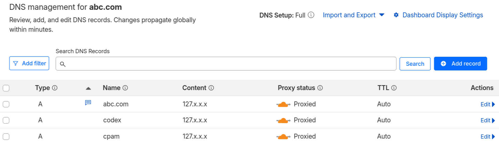
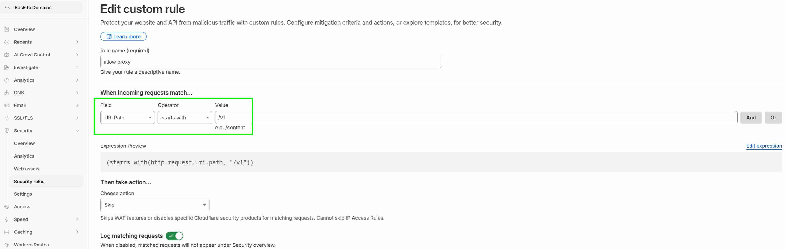

# codex-gateway

[English](./README.md)

`codex-gateway` 是一个便携的 Docker Compose 启动包，用来通过 `VPS + CLIProxyAPI/CPA + Cloudflare` 转发 Codex 兼容的 code agent 请求。适合已经持有域名、已经接入 Cloudflare、希望快速落一套自托管网关的使用场景。需要 token 分发时，也可以通过同一个 Compose 文件按需启动 Done Hub。

这个仓库不负责自动创建 VPS、Cloudflare 或 Nginx 配置，它提供的是最小可部署运行时：`config.yaml`、`docker-compose.yml`、持久化目录，以及一个可直接合并到现有边缘代理中的 Nginx 示例配置。

## 项目作用

- 用 `codex.abc.com` 暴露 Codex 兼容的 `/v1` API
- 用 `cpam.abc.com` 暴露 CPA Manager 管理页面
- 将容器端口限制在 `127.0.0.1`，由 Nginx 和 Cloudflare 对外提供访问
- 提供一套可重复使用的认证、日志和本地数据目录结构
- 可选用 `hub.abc.com` 暴露 Done Hub token 分发服务

## 部署流程

### 1. 前置条件

- 一台安装了 Docker Engine 和 Docker Compose 插件的 Linux VPS
- 一个已经托管到 Cloudflare 的域名，例如 `abc.com`
- VPS 上已有 HTTPS 反向代理。仓库中的 [nginx.sample.conf](./nginx.sample.conf) 是参考配置。
- VPS 上已安装 `openssl`

### 2. 使用 OpenSSL 生成管理密钥和客户端 API Key

先生成两个随机值：

```bash
MANAGEMENT_KEY="$(openssl rand -hex 32)"
CLIENT_API_KEY="$(openssl rand -hex 32)"

printf 'Management Key: %s\n' "$MANAGEMENT_KEY"
printf 'Client API Key: %s\n' "$CLIENT_API_KEY"
```

然后编辑 [config.yaml](./config.yaml)，替换以下两个占位符：

- `CHANGE_ME_MANAGEMENT_KEY` -> `MANAGEMENT_KEY`
- `CHANGE_ME_CLIENT_API_KEY` -> `CLIENT_API_KEY`

这里有一个和当前仓库实现强相关的细节：`docker-compose.yml` 里的 CPA Manager 还会从 `./secrets/cpa_management_key` 读取管理密钥，所以第一次启动前还要把同一个明文管理密钥写进去：

```bash
mkdir -p auths data logs secrets
printf '%s' "$MANAGEMENT_KEY" > secrets/cpa_management_key
chmod 600 secrets/cpa_management_key
```

注意：CLIProxyAPI 首次启动时可能会把 `config.yaml` 里的管理密钥改写成哈希值，所以一定要把最初的明文 `MANAGEMENT_KEY` 另外保存好。后面登录管理页面时，仍然要输入这个明文值。

如果需要同时启用 Done Hub token 分发，再生成 Done Hub 使用的数据库和会话密钥：

```bash
DONE_HUB_DB_PASSWORD="$(openssl rand -hex 24)"
DONE_HUB_MYSQL_ROOT_PASSWORD="$(openssl rand -hex 24)"
DONE_HUB_SESSION_SECRET="$(openssl rand -hex 32)"
DONE_HUB_USER_TOKEN_SECRET="$(openssl rand -hex 32)"

printf 'DONE_HUB_DB_PASSWORD=%s\n' "$DONE_HUB_DB_PASSWORD"
printf 'DONE_HUB_MYSQL_ROOT_PASSWORD=%s\n' "$DONE_HUB_MYSQL_ROOT_PASSWORD"
printf 'DONE_HUB_SESSION_SECRET=%s\n' "$DONE_HUB_SESSION_SECRET"
printf 'DONE_HUB_USER_TOKEN_SECRET=%s\n' "$DONE_HUB_USER_TOKEN_SECRET"
```

然后编辑 [docker-compose.yml](./docker-compose.yml)，替换 Done Hub 相关占位符：

- `CHANGE_DB_PASSWORD` -> `DONE_HUB_DB_PASSWORD`
- `CHANGE_DONE_HUB_MYSQL_ROOT_PASSWORD` -> `DONE_HUB_MYSQL_ROOT_PASSWORD`
- `CHANGE_SESSION_SECRET_64_HEX` -> `DONE_HUB_SESSION_SECRET`
- `CHANGE_USER_TOKEN_SECRET_64_HEX` -> `DONE_HUB_USER_TOKEN_SECRET`

Done Hub 还支持可选的 `HASHIDS_SALT`。虽然变量名里有 salt，但 Done Hub 会按 Hashids alphabet 校验它：每个字符都必须唯一。不要用 `openssl rand -hex` 生成这个值，因为随机 hex 一定会出现重复字符，启动时可能报 `alphabet must contain unique characters`。

如果你确实要设置它，可以先生成一组打乱顺序的唯一字符，再加到 `done-hub.environment` 里：

```bash
DONE_HUB_HASHIDS_SALT="$(printf '%s' 'abcdefghijklmnopqrstuvwxyzABCDEFGHIJKLMNOPQRSTUVWXYZ0123456789' | fold -w1 | shuf | tr -d '\n')"
printf 'DONE_HUB_HASHIDS_SALT=%s\n' "$DONE_HUB_HASHIDS_SALT"
```

不启用 token 分发时，可以不替换这些 Done Hub 占位符。

### 3. 启动 Docker Compose

不需要 token 分发，只启动 Codex 网关和 CPA Manager：

```bash
docker compose up -d
docker compose logs -f --tail=100
```

需要 token 分发，同时启动 Done Hub、Done Hub MySQL 和 Done Hub Redis：

```bash
docker compose --profile token-hub up -d
docker compose --profile token-hub logs -f --tail=100
```

可以先做本地检查：

```bash
curl -i http://127.0.0.1:8317/v1/models
curl -i http://127.0.0.1:18317/health
curl -i http://127.0.0.1:4037/api/status
```

其中 `4037` 只有启用 token 分发时才会存在。这一阶段服务应该只监听本机回环地址，不要把 `8317`、`18317`、`1455`、`4037` 直接暴露到公网。

### 4. 接入 Nginx

把 [nginx.sample.conf](./nginx.sample.conf) 里的 `server` 块合并到你现有的 Nginx 配置中，并按你的环境修改证书路径。前两个 `server` 块用于基础网关；如果启用 Done Hub token 分发，再加入 `hub.abc.com` 对应的可选 `server` 块。

目标转发关系如下：

- `codex.abc.com` -> `127.0.0.1:8317`
- `cpam.abc.com` -> `127.0.0.1:18317`
- `hub.abc.com` -> `127.0.0.1:4037`，仅 token 分发需要

合并完成后重载 Nginx。

### 5. 添加 Cloudflare DNS

不需要 token 分发时，在 Cloudflare 中增加两条 DNS 记录：

- `A` 记录：`codex.abc.com` -> 你的 VPS 公网 IP
- `A` 记录：`cpam.abc.com` -> 你的 VPS 公网 IP

需要 token 分发时，再增加第三条 DNS 记录：

- `A` 记录：`hub.abc.com` -> 你的 VPS 公网 IP

建议的 Cloudflare 设置：

- 所有记录都开启橙云代理
- `SSL/TLS` 设为 `Full (strict)`
- 对 `codex.abc.com/*`、`cpam.abc.com/*` 和 `hub.abc.com/*` 配置绕过缓存
- 不要给 `codex.abc.com` 增加交互式挑战页，否则 CLI 客户端容易失败

### 6. 管理界面截图

- cloudflare DNS 记录



- cloudflare 安全规则



### 7. 登录服务

浏览器打开：

```text
https://cpam.abc.com/
```

按提示输入前面生成的原始明文 `CHANGE_ME_MANAGEMENT_KEY`，即可完成管理登录。

如果启用了 Done Hub token 分发，浏览器打开：

```text
https://hub.abc.com/
```

然后在 Done Hub 后台完成管理员账号、渠道和 token 分发配置。

### 8. 登录 Codex OAuth

在管理页面中继续发起 Codex OAuth 登录流程。登录过程中你会拿到一个很长的回调地址，格式类似：

```text
http://localhost:1455/...
```

把这整条 `localhost:1455` 回调地址完整复制回页面中。凭据写入 `auths/` 后，整个服务部署就完成了。

## 运维提示

- `auths/`、`data/`、`logs/`、`secrets/` 都属于敏感目录，不要提交到 Git，也不要通过公网目录暴露。Done Hub 的数据库会写入 `data/done-hub/mysql/`。
- `1455` 只用于 OAuth 回调，应始终保持为 `127.0.0.1` 本地监听。
- 如果你希望给 `cpam.abc.com` 再加一层防护，可以放在 Cloudflare Access 后面。

## 致谢

这套部署方式直接受益于以下开源项目：

- [router-for-me/CLIProxyAPI](https://github.com/router-for-me/CLIProxyAPI)
- [seakee/CPA-Manager](https://github.com/seakee/CPA-Manager)
- [deanxv/done-hub](https://github.com/deanxv/done-hub)
- [nginx/nginx](https://github.com/nginx/nginx)
- [docker/compose](https://github.com/docker/compose)
